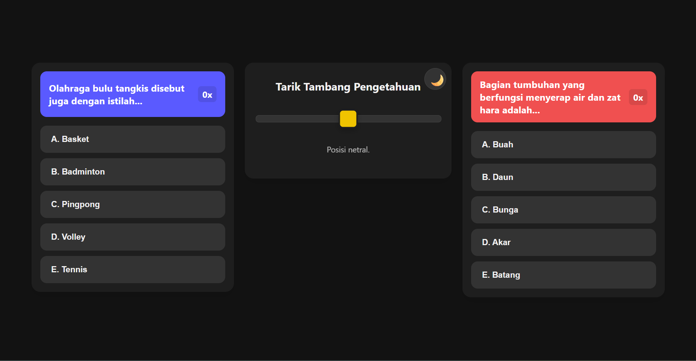

<div align="center"><br><h2 align="center"> 🧠 The Ultimate Real-Time Knowledge Battle 🧠 </h2><p align="center">

  

  

  

🟦 P1 [======== 🎗️ ========] P2 🟥

[View Demo](#)

</div>

## 🚀 About The Project

Brain Tug-of-War is not just a quiz; it's a battle of speed and intellect!

Forget boring, turn-based quizzes. This is a real-time duel where two players answer different questions simultaneously on the same screen. Every correct answer pulls the rope closer to victory. Every second counts.

## ✨ Why is it Super Cool?

1️⃣⚡ Real-Time Adrenaline: No waiting for turns. Answer fast or lose ground!</br>
2️⃣🌓 Solar & Lunar Mode: Features a built-in Dark/Light mode toggle for late-night battles.</br>
3️⃣🎲 Dynamic Chaos: Questions and options are shuffled every time using the Fisher-Yates algorithm. No memorizing patterns!</br>
4️⃣🎨 Visual Feedback: Instant green/red cues tell you if you're a genius or if you need to study more.</br>

## 📸 Screenshots

<p align="center">

style="border-radius: 10px; margin-right: 10px; box-shadow: 0 4px 8px 0 rgba(0, 0, 0, 0.2);">
</p>
</details>
<details>
<summary><b><code>./main.exe 6</code> (Tampilkan File Debug)</b></summary>

<p align="center">

style="border-radius: 10px; margin-right: 10px; box-shadow: 0 4px 8px 0 rgba(0, 0, 0, 0.2);">
</p>
</details>
<details>
<summary><b><code>./main.exe 6</code> (Tampilkan File Debug)</b></summary>

## 🎮 How To Play

The rules are simple, but the game is hard.

Grab a Friend: You need 2 humans (or play against yourself if you're fast!).

Choose Your Side:

🔵 Player 1 (Blue): Left Side

🔴 Player 2 (Red): Right Side

Start Tapping: Questions will appear. Tap the correct option (A-E).

Pull the Rope:

✅ Correct: The rope moves 1 step toward you.

❌ Wrong: The rope stays, but you lose time!

Victory: Pull the marker 6 steps to your side to WIN! 🏆

🛠️ Installation

Want to run this on your local machine? It's super easy.

Bash

# 1. Clone this repository

git clone [https://github.com/Haerul/brain-tug-of-war.git](https://github.com/Haerul/brain-tug-of-war.git)# 2. Navigate to the foldercd brain-tug-of-war# 3. Open index.html# You can just double click index.html or serve it via Live Server

## 📂 Project Structure

A clean code structure for a clean game.

```Bash

tarik-tambang-pengetahuan-umum/
├── 📄 index.html # The Arena (HTML Structure)
├── 🎨 style.css # The Look (Styling & Animations)
├── 🧠 script.js # The Brain (Game Logic, Shuffle, Dark Mode)
├── 📚 questions.js # The Knowledge (Question Bank)
└── 🖼️ assets/ # Images & Icons
```

## 🔮 Future Roadmap

[✅] Dark Mode Toggle 🌙</br>
[✅] Random Shuffle Options 🔀</br>
[✅] Add "Subject Selection" (Math,History, Science)</br>
[ ] Add Sound Effects (BGM & Correct/Wrong sounds)</br>
[ ] Mobile Responsive Layout (Vertical Mode)</br>
[ ] AI Opponent Mode 🤖</br>

<div align="center">

Created with ☕ by Haerul

<p>

<a href="https://github.com/yourusername">


</a>

<a href="https://instagram.com/yourusername">


</a>

</p>

© 2025 Design By Haerul

</div>

### 🎨 Cara Menggunakan README ini:

1.  Buat file bernama `README.md` di dalam folder proyek kamu.

2.  Copy semua kode di atas dan paste ke dalamnya.

3.  **Penting:**

    - Pastikan kamu punya folder bernama `assets` dan masukkan screenshot game kamu di sana dengan nama `screenshot-light.png` dan `screenshot-dark.png`.

    - Ubah link `https://github.com/yourusername` dengan link profil GitHub kamu yang asli.

Hasilnya akan menampilkan teks animasi bergerak, badges berwarna-warni, dan tata letak yang sangat profesional\! Selamat mencoba, Haerul\! 🚀
